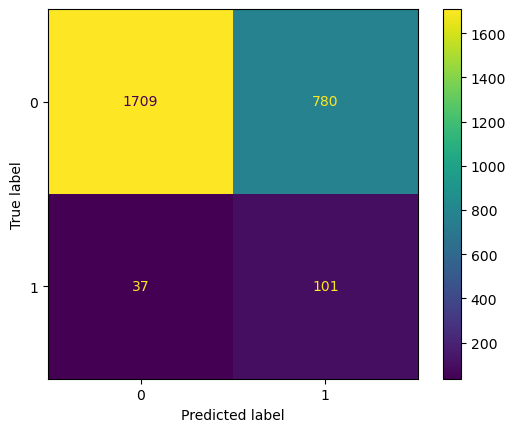

# West Nile Virus Analysis & Prediction

## Executive Summary

West Nile virus (WNV) is the leading cause of mosquito-borne disease in the US, and it is spread to people by the bite of an infected mosquito, specifically a Culex pipiens mosquito. One in five infected people with WNV would experience fever, nausea, headache and muscle aches lasting from a few days to a few weeks - while the remaining four out of five would not exhibit any symptoms. To date, the virus remains a major concern as individuals with weaker immune systems and those above 60 are at higher risk for severe illness from WNV - raking up medical costs and creating more burden in the healthcare system. 

Every year the Chicago Department of Public Health (CDPH) runs a comprehensive surveillance program in suburban areas to trap mosquitoes and test them for WNV. This data has helped CDPH target high-risk areas for the virus and significantly reduce the number of positive cases in the last few years. ([source](https://www.chicago.gov/content/dam/city/depts/cdph/statistics_and_reports/CDInfo_2013_JULY_WNV.pdf))

However in 2021, Chicago was ranked one of the top five US cities with mosquitoes - putting its residents at risk of contracting WNV. ([source](https://www.fox32chicago.com/news/chicago-to-spray-insecticide-to-protect-against-west-nile-virus)). Furthermore in the last two years, much of the public efforts and funding were focused on keeping the city safe from COVID-19. Now, ahead of the looming recession and tightening of budgets ([source](https://www.economist.com/the-world-ahead/2022/11/18/why-a-global-recession-is-inevitable-in-2023)), the CDPH recognized an urgency to plan ahead and be prudent about spending. 

Our team at the Disease and Treatment Agency was tasked to analyze the years with more severe WNV outbreak and devise a plan to identify potential hotspots, ahead of the 2023 summer period.

**Our problem statement:**
To build a model with more than 70% recall to predict the period and location where mosquitoes will test positive for WNV, enabling CDPH to preemptively allocate the city’s spraying resources to curb the virus transmission.

## Content

- [Part 1: Data Cleaning](./code/Part_1_WNV_Cleaning.ipynb)
- [Part 2: Exploratory Data Analysis](./code/Part_2_WNV_EDA.ipynb)
- [Part 3: Modeling & Tuning](./code/Part_3_WNV_Modeling.ipynb)
- [Part 4: Cost-Benefit Analysis & Conclusion](./code/Part_4_WNV_CBA_Conclusion.ipynb)

## About the datasets

- [`train.csv`](./assets/train.csv): This is the main dataset we'll be working with, which contains 10,506 observations on the presence of West Nile Virus across neighborhood clusters in Chicago, Illinois. This dataset is taken from the years 2007, 2009, 2011 and 2013. There are a total of 11 variables involved in tracking the West Nile Virus in the neighborhoods.
- [`test.csv`](./assets/test.csv): There's a total of 11 features and 116,293 observations for the years 2008, 2010, 2012 and 2014. The presence of West Nile Virus is missing from this set, which we will use our model to predict. 
- [`spray.csv`](./assets/spray.csv): This dataset contains 14,835 geographic information system (GIS) data on the city's spraying efforts in 2011 and 2013 - including the date, time, latitude and longitude.
-  [`weather.csv`](./assets/weather.csv): This dataset contains weather information from 2007 to 2014 - covering 2,944 observations across 22 relevant weather-related variables. 
- [`mapdata_copyright_openstreetmap_contributors.txt`](./assets/mapdata_copyright_openstreetmap_contributors.txt): Map files from Open Streetmap and used for visualizations in the analysis. 

## Data Dictionary

| **Feature**            	| **Type** 	| **Dataset**              	| **Description**                                                                         	|
|------------------------	|----------	|--------------------------	|-----------------------------------------------------------------------------------------	|
| Id                     	| int      	| `train.csv` & `test.csv` 	| ID number of the record                                                                 	|
| Date                   	| object   	| `train.csv` & `test.csv` 	| Refers to the date the West Nile Virus test is performed                                	|
| Address                	| object   	| `train.csv` & `test.csv` 	| The approximate address of the location of trap; sent to GeoCoder                       	|
| Species                	| object   	| `train.csv` & `test.csv` 	| The mosquito species in trap                                                            	|
| Block                  	| int      	| `train.csv` & `test.csv` 	| Refers to block number of address                                                       	|
| Street                 	| object   	| `train.csv` & `test.csv` 	| Refers to street of address                                                             	|
| Trap                   	| object   	| `train.csv` & `test.csv` 	| ID number of the trap                                                                   	|
| AddressNumberAndStreet 	| object   	| `train.csv` & `test.csv` 	| The approximate address retrieved from GeoCoder                                         	|
| Latitude               	| float    	| `train.csv` & `test.csv` 	| The latitude retrieved from GeoCoder                                                    	|
| Longitude              	| float    	| `train.csv` & `test.csv` 	| The longitude retrieved from GeoCoder                                                   	|
| AddressAccuracy        	| int      	| `train.csv` & `test.csv` 	| The accuracy of information returned from GeoCoder                                      	|
| NumMosquitos           	| int      	| `train.csv` & `test.csv` 	| The number of mosquitoes in the trap                                                    	|
| WnvPresent             	| int      	| `train.csv` & `test.csv` 	| Whether or not West Nile Virus is present in these mosquitoes (1 = present; 0 = absent) 	|
| Date                   	| object   	| `spray.csv`              	| The date of spray                                                                       	|
| Time                   	| object   	| `spray.csv`              	| The time of spray                                                                       	|
| Latitude               	| float    	| `spray.csv`              	| Latitude of spray                                                                       	|
| Longitude              	| float    	| `spray.csv`              	| Longitude of spray                                                                      	|
| Station                	| int      	| `weather.csv`            	| Refers to the weather station (1 or 2)                                                  	|
| Date                   	| datetime 	| `weather.csv`            	| Refers to the date of measurement                                                       	|
| Tmax                   	| int      	| `weather.csv`            	| Maximum daily temperature (Degrees Fahrenheit)                                          	|
| Tmin                   	| int      	| `weather.csv`            	| Minimum daily temperature (Degrees Fahrenheit)                                          	|
| Tavg                   	| object   	| `weather.csv`            	| Average daily temperature (Degrees Fahrenheit)                                          	|
| Depart                 	| object   	| `weather.csv`            	| Departure from normal temperature (Degrees Fahrenheit)                                  	|
| Dewpoint               	| int      	| `weather.csv`            	| Average dew point (Degrees Fahrenheit)                                                  	|
| WetBulb                	| object   	| `weather.csv`            	| Average wet bulb (Degrees Fahrenheit)                                                   	|
| Heat                   	| object   	| `weather.csv`            	| Heating degree days                                                                     	|
| Cool                   	| object   	| `weather.csv`            	| Cooling degree days                                                                     	|
| Sunrise                	| object   	| `weather.csv`            	| Time of sunrise (calculated, not observed)                                              	|
| Sunset                 	| object   	| `weather.csv`            	| Time of sunset (calculated, not observed)                                               	|
| CodeSum                	| object   	| `weather.csv`            	| Code of weather phenomena                                                               	|
| Depth                  	| object   	| `weather.csv`            	| Depth of snow on the ground (M = Missing data)                                          	|
| Water1                 	| object   	| `weather.csv`            	| Water equivalent (M = Missing data)                                                     	|
| SnowFall               	| object   	| `weather.csv`            	| Snowfall (inch) (M = Missing data, T= Trace)                                            	|
| PrecipTotal            	| object   	| `weather.csv`            	| Total daily rainfall (inch)                                                             	|
| StnPressure            	| object   	| `weather.csv`            	| Average atmospheric pressure (inch Hg)                                                  	|
| SeaLevel               	| object   	| `weather.csv`            	| Average sea level pressure (inch Hg)                                                    	|
| ResultSpeed            	| float    	| `weather.csv`            	| Resultant wind speed (mph)                                                              	|
| ResultDir              	| int      	| `weather.csv`            	| Resultant wind direction (Degrees)                                                      	|
| AvgSpeed               	| object   	| `weather.csv`            	| Average wind speed (mph)                                                                	|

## Methodology

For this project, we've conducted a thorough analysis and modelling through these steps:
1. **Data Cleaning**: We assessed the training dataset for any outliers and removed them immediately. We also checked for missing values where we've filled them or removed them if irrelevant.
2. **Exploratory Data Analysis**: We visualized the dataset through a series of graphs and plots to better understand the relationships between variables as well as its individual impact the spread of the West Nile Virus.
3. **Feature Engineering & Data Preprocessing**: After evaluating specific variables, we removed variables that didn't have much impact and combined variables that were relevant to each other.
4. **Data Modeling & Evaluation**: Based on the selected features, we modeled them through these classification models - Histogram-Based Gradient Boosting Classifier, Logistic Regression, KNeighbors Classifier and Adaptive Boosting Classifier. The best model will then be used to predict the presence of West Nile Virus in the test dataset. 
5. **Cost-Benefit Analysis**: Following the best model selected, we also conducted a cost-benefit analysis on annual cost of pesticide coverage and its benefits - particularly for areas that are at higher risk.

## Initial Findings

1. The main mosquito species carrying WNV are CULEX PIPIENS and CULEX RESTUANS. They form 90% of the infected mosquitoes collected.
2. The overall mosquito population will peak during summer and decreases in the subsequent weeks as the weather cools.
3. There is a lag time from the start of the summer season when mosquito population peaks to when first cases of infected mosquitoes are detected.
4. At higher temperature coupled with higher dew point, wet bulb and humidity readings, we saw more infected mosquitoes. 
5. Meanwhile, there are more infected mosquitoes present when there’s lower wind speed and lower rainfall - these conditions make it easier for their mobility and growth.
6. When it comes to spraying efforts, the 2011 efforts were done towards the end of summer, which did not have an impact on the mosquito count and WNV presence.
7. However in 2013, spraying was done more often from mid-season and we can see that there is some impact on the mosquito count and virus presence. However the effect does take a while to work, suggesting that the spraying efforts should be done earlier.
8. We were able to identify several WNV hot spots over the years:
    - 2007: South Doty Avenue
    - 2009: O'Hare International Airport and South Kedzie Avenue
    - 2011: O'Hare International Airport
    - 2013: O'Hare International Airport
9. Seeing that the hot spots were mostly concentrated around the airport area, we noticed the spraying efforts were mostly done in the north side (closer to the airport) in 2011 and 2013.

## Modeling Results

**Summary of Model Performance**

| Model                          | Train Score | Test Score | Score Delta |
|--------------------------------|:-----------:|:----------:|:-----------:|
| LogisticRegression             | 0.8434      | 0.7809     | 0.0626      |
| KNeighborsClassifier           | 0.9605      | 0.7771     | 0.1834      |
| AdaBoostClassifier             | 0.8724      | 0.7954     | 0.0770      |
| HistGradientBoostingClassifier | 0.9210      | 0.8134     | 0.1077      |

Based on the selected features, the **Logistic Regression** model had the best overall performance after taking into account the generalizability of the model with unseen datasets.

Recall = 0.73
    
## Cost-Benefit Analysis

We proposed three potential approach for spraying efforts, below is a summary:
- **Option 1: Spray all city area on a weekly basis** 
    - Spraying all areas in Chicago limits us from identifying the regions with hot spots accurately after the operation completes.
    - It's more harmful for the environment with the frequent spraying and may also irritate residents with sensitive skin and sense of smell.
    - Even with this approach, there are still risks of positive cases so this approach will not guarantee that the city will be free of WNV - in fact, it could lead to the city wasting more resources.
- **Option 2: No spray at all**
    - When we choose not to spray at all, there is a much higher risk of people contracting WNV as it's one of the more widespread adult mosquito control measure.
    - Hence this would lead to higher hospitalization cost and productivity loss - our analysis shows that the city risks losing up to USD5,681,655.
- **Option 3: Targeted spray in 3-4 neighborhoods per week**
    - This appears to be the best approach as it's the lowest in spraying cost.
    - This helps minimize environmental impact from spraying and also reduce harm to the residents.
    - Furthermore, this approach demonstrate the benefits in cost savings of **USD460,512** for spray, when compared to Option 1.

Hence, we would recommend pursuing the targeted spraying approach:
- USD746,227 in total cost for spraying as well as medical costs and productivity loss
- USD460,512 in cost savings for spray as compared to spraying the entire city every week
- While there are still a few human cases, but knowing this now will help us prepare for severe illnesses ahead of time

## Limitations

There were several limitations in the model's ability to predict or classify the presence of WNV, including:

**1. Data availability and quality**:
- The classifier model need to rely on large amounts of high-quality data to make accurate predictions. There is insufficient data regarding spraying, as 2011 and 2013 datasets was the only spray data recorded. Data such as bird cases and human cases are also additional indicators that can be used to better detect WNV presence in areas around Chicago.
- For this project, the full effectiveness of the spray had to be predicted via feature engineering and the use of proxies to forecast subsequent years. 

**2. Limited generalizability**:
- The current model is trained on a specific dataset and may not be able to generalize to other datasets or situations. This can be a particular issue when trying to predict WNV infection, as the distribution of WNV cases can vary significantly from state to state.

## Conclusion

In summary, our model was able to:
1. Achieve target recall more than 70%: Model's recall is 73% through the Logistic Regression Classifier 
2. This allowed us to optimize a targeted spraying approach to save **USD460,512** in spraying efforts

## Recommendations

Through our model and proposed targeted approach, CDPH will be able to optimize spray in terms of frequency and locations to reduce the amount of unnecessary spraying in areas where WNV is absent. Sprays should also be done when there is low wind speeds to prevent the spray from blowing away too quickly.

However on top of our model, controlling mosquito population and curbing virus transmission will require a holistic approach. This could be done in a few ways:
1. **Larviciding**: As spraying only kills off adult mosquitoes, larvicides can help aid in killing mosquito larvae before they grow into adults, helping reduce the overall population.  
2. **Repellents**: Distribute insect repellents to the general public will encourage individuals to keep their homes and household safe from mosquitoes.   
3. **Mosquito repellent screens**: These should also be installed in prime areas such as public schools or event spaces to reduce the amount of mosquitoes from entering buildings. To further support community-wide mosquito control efforts, mosquito nets can be given to locals as well. 
4. **Educational campaigns at schools**: During the summer, most American students spend a lot of time at home and can chip in to help their parents keep their houses tidy. CDPH could consider running awareness workshops at schools in the spring time, to encourage students to keep their homes clean during the summertime.
5. **Increase frequency of trash collection**: Increase frequency of trash collection where disposables such as cups and containers are thrown away more often, particularly in open areas such as parks and outdoor malls. This would help prevent creating ideal breeding conditions for mosquitoes. 
6. **Creating alerts in neighborhoods**: Similar to how Singapore keep residents informed of dengue cases, Chicago neighborhoods can consider alerting local residents whenever WNV is detected. This can be done with a flyer on notice board or text alert that indicates active WNV virus in the community. 

The quest to improve the recall and accuracy of our WNV virus detection model is an ongoing one, which we can achieve by:
1. Keeping closer track of spray data from the last few years
2. Including other variables, such as human cases and dead bird cases
3. Using local neighborhood's weather data for higher location accuracy

## Additional References

1. [Relative Humidity Calculator](https://www.omnicalculator.com/physics/relative-humidity)
- We referred to this humidity calculator to derive the relative humidity in our `weather.csv` dataset.

2. [Life Cycle of Culex Species Mosquitoes](https://www.cdc.gov/mosquitoes/about/life-cycles/culex.html)
- We referred to this article to better understand the life cycle of Culex Pipiens mosquitoes, which was quoted in the EDA portion.

3. [Spatial and Temporal Variation in Vector Competence of Culex pipiens and Cx. restuans Mosquitoes for West Nile Virus](https://www.ajtmh.org/view/journals/tpmd/83/3/article-p607.xml)
- This academic journal studied the difference between Culex Pipiens and Culex Restuans - both vectors of WNV.
- We've quoted this research in the EDA section on breakdown of species.

4. [The drivers of West Nile virus human illness in the Chicago, Illinois, USA area](https://www.ncbi.nlm.nih.gov/pmc/articles/PMC7241786/)
- This academic journal assessed the WNV cases and surveillance program in Chicago, Illinois and studied the factors influencing the WNV spread in the city and the surrounding counties.
- We extracted [Table 2](https://www.ncbi.nlm.nih.gov/pmc/articles/PMC7241786/table/pone.0227160.t002/?report=objectonly) for the cost-benefit analysis of this project. The table contains the annual human WNV cases, and no. positive mosquito pools with the virus in Cook and DuPage counties, where 66% of cases were from Chicago.

5. [CDInfo Surveillance Newsletter July 2013 edition](https://www.chicago.gov/content/dam/city/depts/cdph/statistics_and_reports/CDInfo_2013_JULY_WNV.pdf)
- This newsletter provides a summary of the mosquito surveillance program and cases in the 2012 season - where the city experienced one of the worst outbreak of WNV. The newsletter also covered number of reported human cases, which we've included in the cost-benefit analysis section.
- We referred to this newsletter for a better understanding of the outbreak in 2012 and included suggestion to include other vector control measures in future research (as part of our recommendations). 

6. [Community areas in Chicago](https://en.wikipedia.org/wiki/Community_areas_in_Chicago)
- The Wikipedia page included information about the size of Chicago area and the specific neighborhoods - we used these figures in our cost-benefit analysis.

7. Media articles on spraying efforts in Chicago
- Appended below is a list of articles covering the city's spraying efforts throughout the years. These articles tell us that spraying efforts were done but they were done sporadically and there needs to be a more structured approach to spraying insecticide, which is further explained in the cost-benefit analysis.
    - 2013, [Chicago Begins Spraying For Mosquitoes Wednesday](https://www.nbcchicago.com/news/local/chicago-begins-west-nile-virus-prevention/1958957/)
    - 2017, [City To Spray For Mosquitoes For First Time, Targeting Far South Side](https://www.cbsnews.com/chicago/news/spray-mosquitoes-far-south-side-west-nile-prevention/)
    - 2021, [Chicago to spray insecticide to protect against West Nile Virus](https://www.fox32chicago.com/news/chicago-to-spray-insecticide-to-protect-against-west-nile-virus)
    - 2022, [Mosquito Spray On Thursday, September 8, 2022](http://www.downers.us/top-stories/2022/09/07/mosquito-spray-on-thursday-september-8-2022)

8. [Zenivex Factsheet](https://www.chicago.gov/content/dam/city/depts/cdph/Mosquito-Borne-Diseases/Zenivex.pdf)
- This factsheet covers commonly-asked questions about Zenivex, the insecticide used to rid WNV. 
- We referred to this factsheet that mentioned spray operations would always be notified through the media.

9. [The value of mosquito control](https://www.centralmosquitocontrol.com/-/media/project/oneweb/centralmosquitocontrol/files/us/resources-lit-files/zenivex-cost-comparison-fact-sheet.pdf)
- The flyer indicates the cost for the insecticide Zenivex at 67 cents per acre, a figure we'll use as an approximate in the cost-benefit analysis.

10. [Initial and Long-Term Costs of Patients Hospitalized with West Nile Virus Disease](https://www.ncbi.nlm.nih.gov/pmc/articles/PMC3945683/)
- The study covers the economic cost involved for WNV patients in 2012.
- We reference [Table 4](https://www.ncbi.nlm.nih.gov/pmc/articles/PMC3945683/table/T4/?report=objectonly), the specific figures on medical costs and productivity loss in our cost-benefit analysis.
